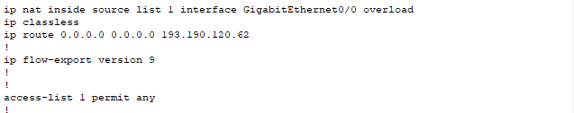
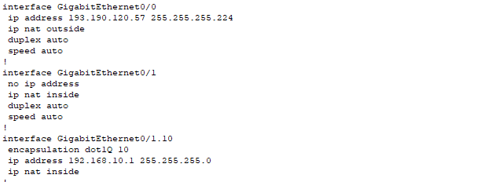
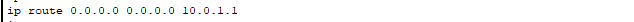
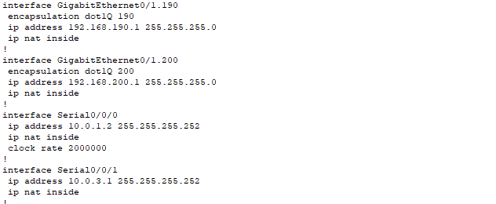
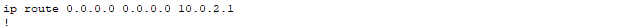
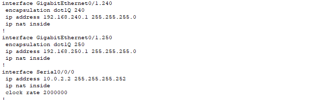
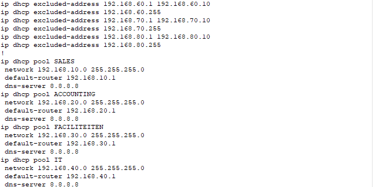

# Internet

Voor alle campussen van internet te voorzien in het dark fiber scenario hebben wij het volgende gedaan.

## Hoofdkantoor

Ten eerste hebben wij voor het hoofdkantoor een default route naar (in dit geval één van de externe ip's van UCLL) het internet en een nat regel met een ACL die al het intern verkeer toelaat.

Realistisch is dit niet secuur en zou men niet alle interne verkeer toelaten.

We zetten ook het externe interface van het hoofdkantoor als de "ip nat outside" en alle interne interfaces als "ip nat inside". En ook het externe ip van het hoofdkantoor ingesteld op het externe inteface van hun router.

Dit zorgt voor basic connectiviteit op het hoofdkantoor.

## Branch en Datacenter

Voor de branch en het datacenter moeten wij dan enkel een default route instellen die naar hun connectie met de router op het hoofdkantoor wijst en alle interfaces op deze plekken op ip nat inside instellen (ook het interface dat geconnecteerd is met het hoofdkantoor, in ons geval serial 0/0/0).

### Branch

### Datacenter

Dit zorgt dat wij naar buiten kunnen maar hierdoor is onze DNS resolutie nog niet in orde.
Dus voor alle vlans voor gebruikers zoals sales, accounting, faciliteiten, it enzovoort hebben wij een dhcp pool aangemaakt waarin de dns wordt ingesteld en hun default router.

## DHCP

Voor dhcp gebruikten wij google als dns (8.8.8.8) en hebben wij ook enkele excluded ip addresses voor elke vlan toegevoegd.

Zoals in de configuraties te zien hebben branch en datacenter ook pools voor hun gebruiker vlans.
Hiermee hebben wij connectiviteit en dns resolutie waardoor onze gebruikers dan dus ook op het internet kunnen.
