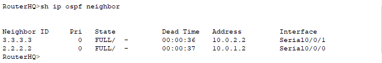
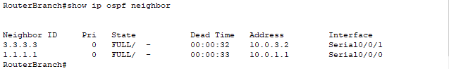
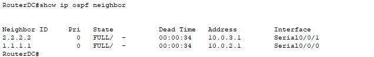
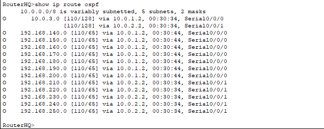
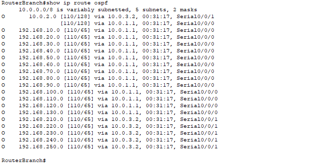
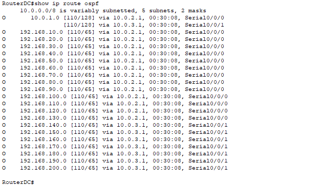

# OSPF

De drie routers adverteren hun netwerken naar hun neighbors, ik heb hiervoor de volgende lijnen van configuratie gebruikt:

### Router OSPF HQ

```
router ospf 1
 router-id 1.1.1.1
 log-adjacency-changes
 passive-interface GigabitEthernet0/1
 network 10.0.1.0 0.0.0.3 area 0
 network 10.0.2.0 0.0.0.3 area 0
 network 192.168.10.0 0.0.0.255 area 0
 network 192.168.20.0 0.0.0.255 area 0
 network 192.168.30.0 0.0.0.255 area 0
 network 192.168.40.0 0.0.0.255 area 0
 network 192.168.50.0 0.0.0.255 area 0
 network 192.168.60.0 0.0.0.255 area 0
 network 192.168.70.0 0.0.0.255 area 0
 network 192.168.80.0 0.0.0.255 area 0
 network 192.168.90.0 0.0.0.255 area 0
 network 192.168.100.0 0.0.0.255 area 0
 network 192.168.110.0 0.0.0.255 area 0
 network 192.168.120.0 0.0.0.255 area 0
 network 192.168.130.0 0.0.0.255 area 0

```

### Router OSPF Branch

```
router ospf 1
 router-id 2.2.2.2
 log-adjacency-changes
 passive-interface GigabitEthernet0/1
 network 10.0.1.0 0.0.0.3 area 0
 network 192.168.140.0 0.0.0.255 area 0
 network 192.168.150.0 0.0.0.255 area 0
 network 192.168.160.0 0.0.0.255 area 0
 network 192.168.170.0 0.0.0.255 area 0
 network 192.168.180.0 0.0.0.255 area 0
 network 192.168.190.0 0.0.0.255 area 0
 network 192.168.200.0 0.0.0.255 area 0
 network 10.0.3.0 0.0.0.3 area 0
```

### Router OSPF Datacenter

```
router ospf 1
 router-id 3.3.3.3
 log-adjacency-changes
 passive-interface GigabitEthernet0/1
 network 10.0.2.0 0.0.0.3 area 0
 network 192.168.210.0 0.0.0.255 area 0
 network 192.168.220.0 0.0.0.255 area 0
 network 192.168.230.0 0.0.0.255 area 0
 network 192.168.240.0 0.0.0.255 area 0
 network 192.168.250.0 0.0.0.255 area 0
 network 10.0.3.0 0.0.0.3 area 0
```

In deze configuratie adverteer ik alle netwerken waarover deze routers waken. De netwerken van kritische infrastructuur zoals camera's en badgelezers kunnen eventueel beveiligd worden door gebruik van ACL's.

Ook heb ik het interne interface van iedere router als passief gezet zodat de netwerken niet in hun eigen netwerk worden geadverteerd. Hiermee kan onnodige trafiek van de ospf "hello" packets vermeden worden.


## Neighbors

Door het commando "show ip ospf neighbor" te gebruiken kan men nu zien dat we de andere campussen als ospf neighbors zien en dus hun netwerk adverteringen zullen ontvangen.

### HQ Neighbors



### Branch Neighbors



### Datacenter Neighbors



## Routes

Door het commando "show ip route ospf" te gebruiken kan men dan zien welke routes de routers nu kennen omwille van de ospf advertering van hun neighbors.

### HQ Routes



### Branch Routes



### Datacenter Routes

