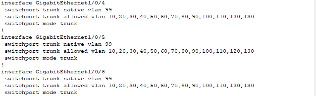
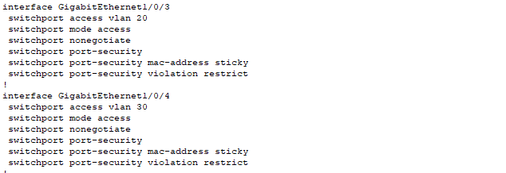
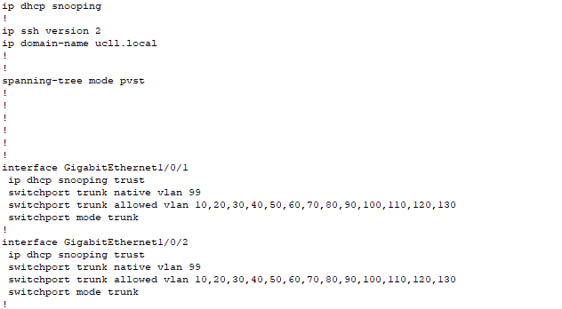
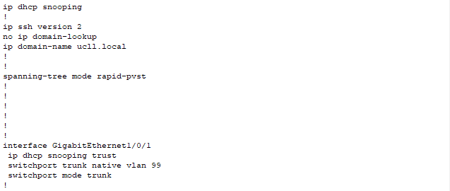

# LAN-Beveiliging

Voor lan-beveiliging hebben wij naar drie zaken gekeken en leg ik best ook even ons netwerk design wat verder uit.

Elke locatie heeft 1 core switch en een distribution layer switch, om toch iets of wat een professionele omgeving na te bootsen.

De drie zaken naar welke we keken voor lan-beveiliging waren port-security, ip dhcp snooping en bpdu guard.

Voor de core switches op deze locatie hebben wij geen gebruik gemaakt van port-security omdat deze switches meestal achter zware slot en grendel zitten en bij onderzoek bleek dat dit voor problemen kan zorgen in het netwerk.

Alle poorten van de core switches staan wel ingesteld als trunk, niet realistisch dat deze allemaal gebruikt zullen worden maar dit maakte het instellen van deze poorten wat sneller voor ons. Dit zorgt er echter voor dat alle poorten kunnen gebruikt worden om dan distributie laag switches in te steken en dat deze connecties trafiek van alle vlans zullen kunnen dragen.

Dit maakt het mogelijk dat bijvoorbeeld een switch wordt ingestoken op één van de poorten van de core switch en dan kan deze switch gebruikt worden voor alle vlans. Realistisch voorbeeld zou zijn dat er een switch is per verdieping of afdeling van het hoofdkantoor (of de andere locaties) en dat hier dan niet alleen access points kunnen ingestoken worden voor de gebruikers maar dan ook printers, camera's, CV, digitale borden en mogelijk nog andere zaken voor deze afdeling/verdieping.

Op de distributie laag switches hebben we dan momenteel gewoon 1 poort per vlan gestoken, gewoon om aan te tonen hoe dit in zijn werking zou gaan, de andere interfaces hebben we in shutdown gezet.

Op deze switches hebben wij echter wel wat port-security ingesteld.

## Port-Security

Hier is mijn redenering voor deze port-security regels:
- port-security mac-address sticky: dit zodat het mac address van ingestoken toestellen vanzelf wordt aangeleerd door de switch.
- port-security maximum 1: realistisch gaan men enkel vaste apparatuur insteken en gaan deze apparaten niet regelmatig vervangen worden. Ook voor gebruikers kan men gewoon access points insteken en kan men een "BYOD" aanpak toepassen in de bedrijven waarbij elke medewerker een laptop gebruikt en wifi krijgt via deze access points. Deze regel kan men wel niet zien in de configuratie.
- port-security violation restrict: hierdoor gaat een error log gegenereert worden indien men toch over de limiet van 1 apparaat gaat. Deze regel kan nog verstrengt worden zodat deze port in shutdown gaat indien men over de limiet gaat. Maar indien deze locaties een incident response team en siem hebben is dit niet strikt noodzakelijk.

## IP DHCP Snooping

De tweede security instelling die wij gebruikt hebben is IP DHCP Snooping, dit is geactiveerd op alle switches met het commando "ip dhcp snooping" en ingesteld op alle trusted ports (degene die direct geconnecteerd zijn met de dhcp server, de routers). Voor de core switch is dit de port geconnecteerd met de router en de port geconnecteerd met de distributielaag switch en op de distributielaag switch op de poort geconnecteerd met de core switch.

### IP DHCP Snooping Core

### IP DHCP Snooping Distribution

IP DHCP snooping gaat dan dhcp packets inspecteren om na te gaan of deze van trusted ports komen, indien niet zullen deze gedropped worden.

Momenteel hebben wij op de core switch dit enkel ingesteld op de ene poort waar de distributielaag switch op is geconnecteerd, maar dit kan voor de andere poorten ook nog toegevoegd worden afhankelijk van hoeveel distributielaag switches worden toegevoegd.

## BDPU Guard

Hier hebben wij naar gekeken maar bij onderzoek van wat dit juist weer doet leek het ons onlogisch en niet noodzakelijk om toe te voegen aangezien wij slechts 1 mac address toelaten met port-security.

Indien wij het correct begrijpen wordt dit voornamelijk ingesteld op ports waarvan de end-users zullen gebruik maken. Dit in geval dat er een malicious persoon zelf bpdu's gaat aanmaken en versturen op deze poorten, bpdu guard dit dan kan tegengaan. Aangezien wij echter slechts 1 mac address max toelaten, zal er dan ook meteen een error message gegeneerd worden indien een malicious actor een kabel uit bijvoorbeeld een access point trekt en die in zijn eigen laptop steekt om dan malicious bpdu te versturen.

Het incident response team kan hier dan op reageren.

## Tot slot

Ten laatste dacht ik persoonlijk nog aan etherchannel en spanning tree protocol instellingen, dit leek mij echter meer belangrijk voor de stabiliteit van het netwerk en minder voor beveiligingsredenen.