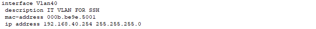
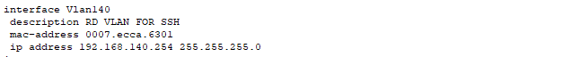
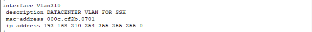

# Remote Access

Voor ssh in te stellen op alle apparaten moeten wij de volgende commando's uitvoeren:

```
username admin secret cisco

ip domain-name ucll.local
crypto key generate rsa general-keys modulus 1024
ip ssh version 2

line vty 0 15
transport input ssh
```
Ook moeten wij een ip instellen op één van de gebruiker vlan interfaces voor de switches zodat we deze kunnen bereiken met SSH. Dit gaat dus in de vlan zijn waar de relevante gebruiker vanuit werkt. Wij hebben geen aparte management vlan aangemaakt maar gewoon al bestaande vlans gebruikt, namelijk IT op HQ, RD op Branch en Datacenter op Datacenter.

Hieronder deze interfaces voor de core switches, die van de distribution layer switches zijn hetzelfde enkel met 253 voor het laatste octet.

## HQ



## Branch



## Datacenter



De routers op deze plekken kunnen bereikt worden met eventueel hun extern ip. Best practice zou zijn dat wij gewoon op alle switches vlan 1 toevoegen als management vlan en hierop het ip zetten. Hieraan dachten wij echter te laat.

Men kan dan ssh-en naar deze apparaten met bijvoorbeeld voor coreswitch op hq "admin@192.168.40.254". Dan zal men voor het paswoord gevraagd worden.